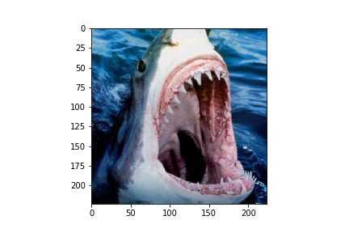

# wwf_shark_id

This is a prototype of an ML powered shark identification system, based on discussions with people from WWF Pakistan.
The end goal is to integrate this into an app that a fisherman can use to identify a given shark species, and know whether it should be released or not.

We query images from ImageNet, filtering to keep only the ones containing sharks. We then finetune an ImageNet pretrained ResNet50 on 7 species of sharks, which are the species with the most images in ImageNet.

We can plot some images and visualise parts of the image that most activate the given class output (here using guided backprop from https://arxiv.org/abs/1412.6806).

